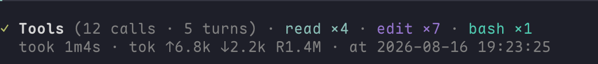
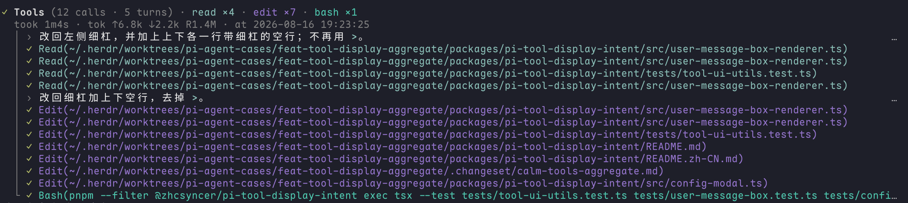

# Pi Tool Display Smooth

Bản fork cộng đồng của **pi-tool-display-intent 0.10.0**, giữ giao diện tool gọn, click mở chi tiết và giảm việc dựng lại nội dung cũ khi cuộn lịch sử.

Phần giao diện, nhóm tool và popup do upstream phát triển. Đóng góp của fork này là cache nội dung tĩnh khi ẩn thinking. [Nguồn gốc và credit](NOTICE.md).

## Ảnh minh hoạ

Ảnh gốc từ [pi-tool-display-intent của zhcsyncer](https://github.com/zhcsyncer/pi-extensions/tree/main/packages/pi-tool-display-intent), đã lưu trực tiếp trong repo và giữ credit upstream. Tên nhãn và màu sắc có thể khác đôi chút theo phiên bản/theme.

**Thu gọn — cả nhóm tool chỉ còn phần tóm tắt ngắn.**



**Mở rộng — xem từng lần đọc file, sửa file và chạy lệnh.**



**Có lỗi — phần tóm tắt vẫn làm nổi bật các lần gọi thất bại.**


## Cài đặt

Đã kiểm với **Pi 0.85.1, Node.js 22**. Nếu đang dùng pi-tool-display-intent, gỡ hoặc tắt bản đó trước để tránh hai extension cùng sửa giao diện.

```sh
pi install git:github.com/nguyenngothuong/pi-tool-display-smooth@v0.1.0
```

Thoát rồi mở lại Pi. Để dùng cách hiển thị gọn, ghép cấu hình mẫu trong [README tiếng Anh](README.md#install) vào các file hiện có; không ghi đè toàn bộ settings.

- Click **Run**: mở hoặc thu gọn nhóm tool.
- Click tên tool: mở chi tiết.
- **Tab**: chuyển Result / Args.
- **Esc**: đóng chi tiết.

Ẩn thinking chỉ thay đổi phần hiển thị. Extension không đổi model hay mức thinking.

## Kết quả kiểm tra

Đo trên cùng bản sao session khoảng 4.2 MB: median phản hồi cuộn từ **32.5 ms xuống 9.5–10.9 ms**, giảm khoảng **67–71%** trong lượt đo thứ hai. Đây là thời gian đến byte phản hồi đầu tiên qua PTY, không phải FPS hay cam kết cho mọi máy.

8 bài test pass; đã kiểm click mở/thu gọn, popup Result/Args và đổi kích thước terminal. Dữ liệu test công khai là dữ liệu giả; không có transcript cá nhân trong repo. Chưa đo bộ nhớ khi chạy dài hạn hoặc xác nhận các phiên bản Pi khác.

## Gỡ và quay lại bản gốc

```sh
pi remove git:github.com/nguyenngothuong/pi-tool-display-smooth@v0.1.0
pi install npm:@zhcsyncer/pi-tool-display-intent@0.10.0
```

Thoát rồi mở lại Pi. Bản fork dùng chung thư mục cấu hình tool-display với upstream. Khi nâng Pi cần kiểm lại vì extension phụ thuộc giao diện nội bộ của Pi.

Mã nguồn và test: `npm ci --ignore-scripts`, rồi `npm run check`. Giấy phép MIT; giữ đầy đủ credit trong LICENSE và NOTICE.md.
